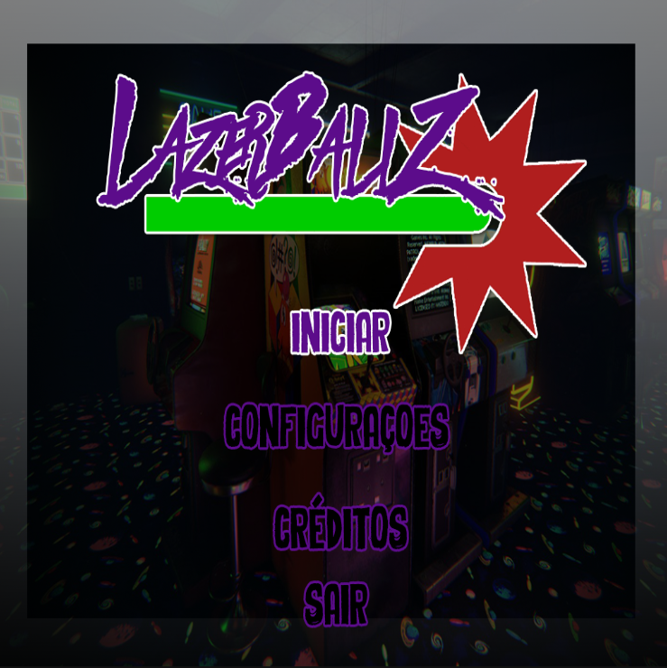
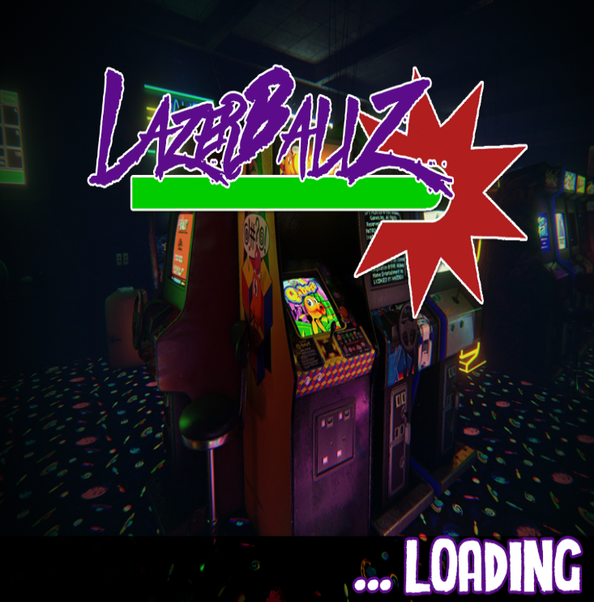
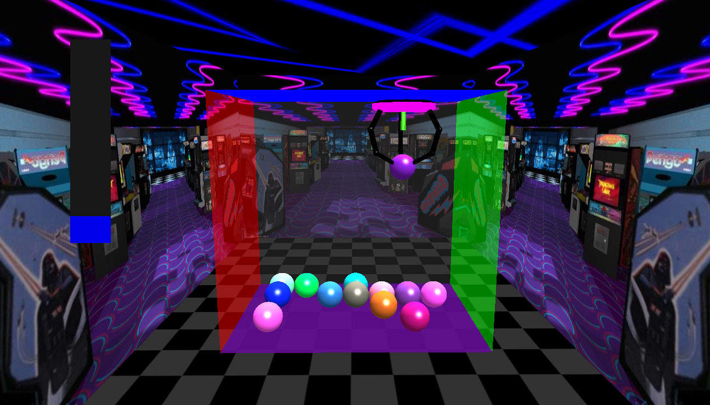
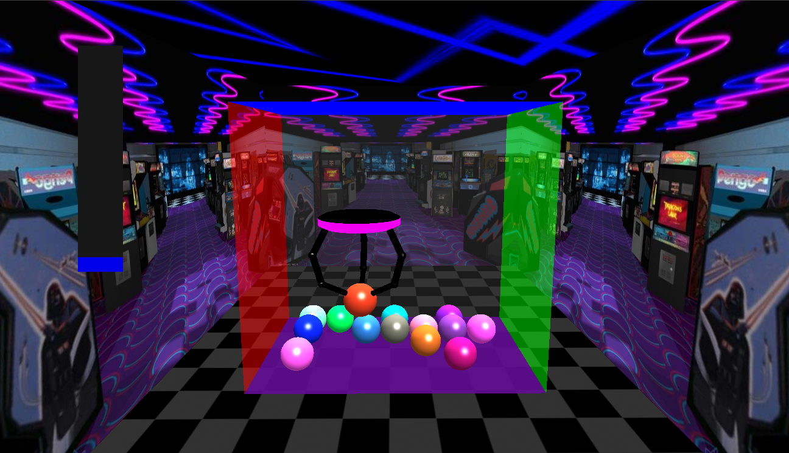

# CG - Trabalho Prático 02
#### O Garra

 Desenvolvido por: **Túlio Assis** && **Arthur Abellice** :+1:
 
## Itens Necessários
 - Freeglut **sudo apt-get install freeglut3-dev**
 - Glew **sudo apt-get install libglew1.6-dev**
 - Soil **sudo apt-get install libsoil-dev**
 - [SFML (áudio)](http://www.sfml-dev.org/)  **sudo apt-get install libsfml-dev**

## Instruções para compilação e execução
 - Codeblocks
> Ao abrir o projeto, selecione o sistema operacional.
> Logo após vá em bibliotecas.h e selecione a biblioteca.

 - Linux **(Terminal)**
> Abra o terminal e vá na pasta raiz do TP
> Faça uso dos seguintes comandos:
> - make install: instalar bibliotecas listadas acimas
> - make all: compilar
> - make run: rodar
> - make clean: limpar os arquivos criados

## The Game
- Mova a guarra com as setas  ← → ↑ ↑
- ESC sai do jogo
- R reinicia

## Screenshot
> Segue mais na pasta [Screenshot](./Screenshot).

## Itens Implementados
### Requisitos obrigatórios

> MUNDO
>> - Claw machine
>> - Objetos

> GARRA
>> - Controle de garra
>> - Descer garra
>> - Abrir e fechar dedo automatico
>> - Não pode ser controlada durante movimento automático
>> - Colisão

> CAMERA
>> - Controlada por mouse e setas

> GRÀFICO
>> - Fonte de luz direcional

### Adicionais
>> - Menu e telas feitos no photoshop:
>>> - Menu geral;
>>> - Pause;
>>> - Reiniciar;
>>> - Game over,
>>> - Creditos;
>>> - Configurações;
>>> - Loading.

>> - Barra progresso 2D
>> - Cursor do mouse diferenciado
>> - A Full Screen para melhor jogabilidade
>> - FOG - ao apertar F ( apenas por motivos esteticos );

>> - Sons escolhidos a dedo :
>>> - Máquina movendo;
>>> - Movimento automático da máquina;
>>> - Som de laser;
>>> - Som Ambiente;

>> - Laser mortal alienigena;
>> - Tema: destruição das bolas com o laser mortal alienigena, ao invez de apenas pegar as bolinhas
>> - Botoes no menu arrojado e contemporaneo
>> - Botões com Click no Menu.
>> - +/-  aumenta diminui objetos (p/ testes e jogos rapidos, com maximo de 15 objetos apenas)
>> - Camera top-down no movimento de descida.
>> - Visões laterais com mouse, e as teclas a e d.
>> - Distribuição de forma procedural e checagem das bolinhas fofas
>> - Animação p/ abrir e fechar a garra.
>> - Skybox do fliperama.
>> - Reshape.
> - Video [Youtube](https://www.youtube.com/watch?v=nKZLvF9l_6Y)

